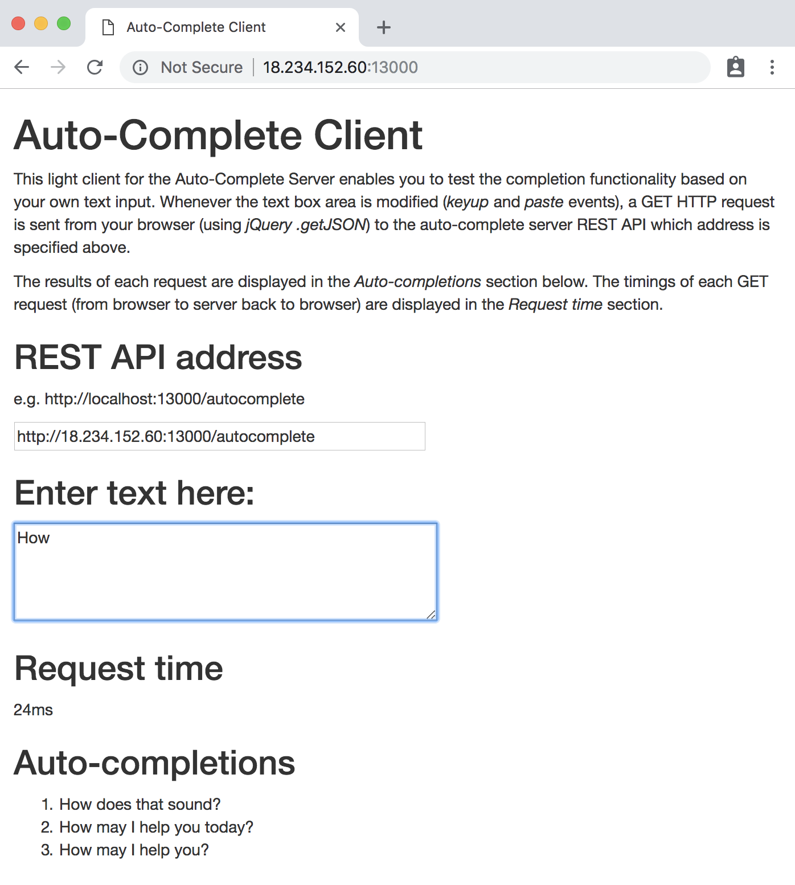

# auto-complete-server

[](https://travis-ci.org/ynouri/auto-complete-server)

Fast auto completion server.

## Introduction

This auto-complete service suggests relevant sentences completions based on a few characters or words entered by a user. The service is fast and can be queried every time the user enters a new keystroke. The auto-completion model is trained on a corpus of conversations.

## Architecture

`auto-complete-server` is made of 3 main components:

* **A language model**. Based on a corpus of sentences, the language model will assign probabilities to sequences of words. This component will ensure that the completions returned by the server are meaningful and relevant for the end-user. In the current version, a very dummy language model is implemented. It is character based and will return the most likely full sentence completion based on sentences frequencies in the corpus. It doesn't use smoothing, backoff or interpolation, or a word based n-gram model. It relies on `nltk` tokenizer to split sentences, and uses `pandas` to manipulate corpus data.

* **The AutoCompleteModel object**, which is currently implemented under the `MostPopularCompletionModel` class. This object will use the probabilities (or counts) generated by the language model and store them in an efficient data structure that will enable fast completion queries through the `generate_completions` method. It relies on a trie data structure implemented by [`datrie`](https://github.com/pytries/datrie) library, which is fast and memory efficient. Currently, `MostPopularCompletionModel` couples both the language model and the completion component.


* **The Tornado web server**. Tornado web framework is fast and non-blocking on network I/O. It is lightweight and therefore adapted to to our needs for the auto-complete micro service. It exposes the `generate_completions` function of the AutoCompleteModel object through a REST API. The completions are returned on an HTTP GET request on the the `autocomplete` resource. The completions are returned in JSON.


## Getting started

### Pre-requisites

* Python 3.6
* Pip
* Git

### Install

```bash
git clone https://github.com/ynouri/auto-complete-server.git
cd auto-complete-server
python -m setup install
```

### Process the sample corpus

```bash
$ ./process_corpus.py data/sample_conversations.json models/sample_conversations.trie
09-24 19:41:04  INFO     Start reading corpus from data/sample_conversations.json
09-24 19:41:04  INFO     Finished reading corpus.
09-24 19:41:04  INFO     Start split messages into sentences...
09-24 19:42:06  INFO     Finished split messages into sentences.
09-24 19:42:06  INFO     Start inserting into trie...
09-24 19:42:07  INFO     Finished inserting into trie.
09-24 19:42:07  INFO     Saving trie to models/sample_conversations.trie
```

### Run the web server

```bash
$ python -m auto_complete_server.web.app --trie-file=models/sample_conversations.trie --port=13000
[I 180924 19:45:24 mpc:28] Loading trie from models/sample_conversations.trie
[I 180924 19:45:24 app:55] Web server listening on 13000
```

### Request completions

The auto-complete service can be queried either directly on its REST API, available at `/autocomplete?q=prefix`:

```bash
$ curl http://18.234.152.60:13000/autocomplete?q=How
{"completions": ["How does that sound?", "How may I help you today?", "How may I help you?"]}
```

Or a simplified client page can also be used by accessing the root of the host:port used (e.g. `http://18.234.152.60:13000/`). The client will take as an input the REST API address, and will suggest completions for any text entered in a text box. Request timings are also displayed for information.




## Docker container

### Build image

The Docker image can be built with the following command.

```bash
docker build -t auto-complete-server .
```

### Auto build

Docker images are automatically built and stored on every push on [Docker Hub](https://hub.docker.com/r/nouri/auto-complete-server/).

### Pull and run

The Docker image corresponding to latest commit on master can be pulled and run easily. The following will download the image and start the web server on port 80.

```bash
docker pull nouri/auto-complete-server:latest
docker run -p 80:13000 nouri/auto-complete-server:latest
```


## Web server performance

### Deployment steps

1. Deploy an AWS EC2 instance:
  * t2.medium
  * Ubuntu Bionic 18.04 AMI
  * Open port 13000 in security group
1. [Install Docker](https://docs.docker.com/install/linux/docker-ce/ubuntu/)
1. Pull most recent auto-complete-server image: `docker pull nouri/auto-complete-server:latest`
1. Run Docker container: `docker run -p 13000:13000 nouri/auto-complete-server:latest`


### Load test

The following load test is run a local New York based laptop and sends requests to the auto-complete server hosted on a us-east AWS instance. Docker image ID used is `e89150f7061b`. Node based [loadtest](https://www.npmjs.com/package/loadtest) utility is used to send a high number of requests with different concurrency settings.


**Concurrency=1**

The average response time is a decent 50ms, without any errors.

```
$ loadtest -n 1000 -c 1 http://54.146.138.202:13000/autocomplete?q=How+can

Completed requests:  1000
Total errors:        0
Total time:          53.15666733 s
Requests per second: 19
Mean latency:        53.1 ms
```

**Concurrency=100**

A single Tornado process can handle a charge 100x bigger without any errors. The mean latency more than doubles to 120ms.


```
$ loadtest -n 100000 -c 100 http://54.146.138.202:13000/autocomplete?q=How+can

Completed requests:  100000
Total errors:        0
Total time:          119.900251101 s
Requests per second: 834
Mean latency:        119.7 ms
```


**Concurrency=500**

With a concurrency of 500, the error rate surges to almost 10% of requests. The mean latency increases to an un-acceptable 600ms. The number of successful requests per second still hovers around 800. This seems to be the maximum that our current  implementation can handle. To increase performance further, a load balancer could be introduced to distribute requests to several Tornado processes (potentially hosted on different VMs).

```
$ loadtest -n 50000 -c 500 http://54.146.138.202:13000/autocomplete?q=How+can

Completed requests:  50000
Total errors:        4760
Total time:          60.870930902 s
Requests per second: 821
Mean latency:        584.3 ms
```

## References

* [Jurafsky & Martin, Speech and Language Processing, 2018](https://web.stanford.edu/~jurafsky/slp3/ed3book.pdf)
* [Mikhail Korobov, Benchmark of various Tries implementations, 2012](http://kmike.ru/python-data-structures/)
* [Bar-Yossef & Kraus, Context-Sensitive Query Auto-Completion, 2011](https://naamakraus.github.io/papers/fr332-bar-yossef.pdf)
